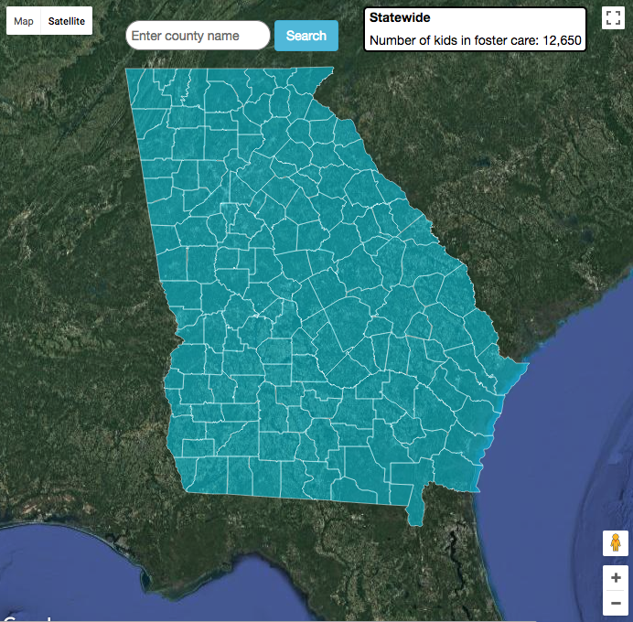
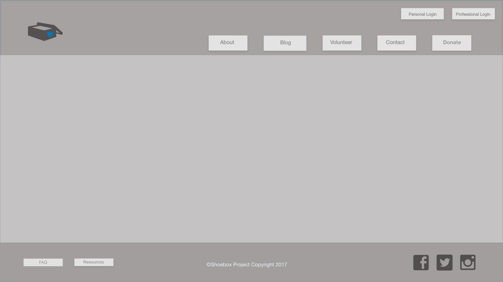

## Overview:
The Shoebox Project is a non-profit company whose purpose is to provide professional photographs and memories for children in the foster care system. We set up a site for the company, including sign-up forms, login capabilities, an interactive map, and various pages to navigate to on the site.


## Github Link:
[The Shoebox Project GitHub](https://github.com/ValerieThoma/baby-unicorns)

## Team Members & Roles:
* [Allyson Conrad](https://github.com/allysonc1)
**Scrum Master/Birthday Girl/Developer**
* [Valerie Jane Thoma](https://github.com/ValerieThoma)
**Designer/Class Clown/Developer**
* [Eddie Atkinson](https://github.com/eddieatkinson)
**Data Wrangler/Map Magician/Developer**


## Technologies used:
**Languages:**
* JavaScript
* HTML5
* CSS

**Frameworks:**
* jQuery
* Bootstrap

**Other:**
* Adobe XD - wireframe
* Google Maps API
* County location data from [CivicDashboards](http://catalog.civicdashboards.com)

## Code snippets:
``` javascript
function mouseInToRegion(e) {
	// set the hover state so the setStyle function can change the border
	e.feature.setProperty('state', 'hover');
	$('#data-label').css('color', 'black');

	// Get county name from JSON and format it to match data in counties array
	var countyNameFromJson = e.feature.getProperty('name');
	var countyNameAsArray = countyNameFromJson.split(" County");
	var countyNameOnlyArray = countyNameAsArray.splice(0, 1);
	var countyNameOnlyString = countyNameOnlyArray.toString();

	// Search for county and display number of children in foster care
	$('#data-label').text(countyNameOnlyString);
	for(let i = 0; i < counties.length; i++){
		if(counties[i].county == countyNameOnlyString){
			$('#data-value').text(counties[i].childrenInFosterCare);
		}
	}
}
```
``` javascript
$(document).ready(()=>{

	// store input data from user signup screen in localStorage
	
		var userObj = {
			userType :  [],
			fullName : [],
			userPhone : [],
			userEmail : [],
			passwd : [],
			signupDate : []
		}
		userObj.signupDate = new Date();

		$('.user-sign-up-form').submit((event)=>{
			event.preventDefault();

			var password = $('.password').val();
			var passwordConfirm = $('.password-confirm').val();

			var numUsers = localStorage.getItem('users-signedup')
			
			if(password != passwordConfirm){
				console.log(password);
				console.log($('.password-confirm').val());
				$('.password-error').html("Your passwords do not match.");
			}else{
				console.log("passwords match")
				
				if(numUsers == null){
					numUsers = 1;
					console.log("numUsers is null",numUsers)
				}else{
					numUsers++;
				}
				console.log("numUsers ",numUsers)
				localStorage.setItem('users-signedup',numUsers)

				userObj.userType= 'Family';
				userObj.fullName = $('.full-name').val();
				userObj.userPhone = $('.phone').val();
				userObj.userEmail = $('.email').val();
				userObj.passwd = $('.password').val();

				localStorage.setItem("userType"+numUsers, userObj.userType);
				localStorage.setItem("password"+numUsers, userObj.passwd);
				localStorage.setItem("fullName"+numUsers, userObj.fullName);
				localStorage.setItem("userEmail"+numUsers, userObj.userEmail);
				localStorage.setItem("userPhone"+numUsers, userObj.userPhone);
				localStorage.setItem("signupDate"+numUsers, userObj.signupDate);

				window.location.href = "user_home.html"
				
			}
		});
		
	});	
```
``` javascript
	//	to access the localStorage:
		var numUsers = localStorage.getItem('users-signedup')
		var enteredEmail = $('.email').val();
		var enteredPassword = $('.password').val();

		for (i=1; i <= numUsers; i++){

			userObj.passwd = localStorage.getItem('password'+i)
			userObj.userEmail = localStorage.getItem('userEmail'+i)
```
## Screenshots:






## Contributing:
1. Allow project administrator (and/or volunteers) to upload photos and documents.
2. Give users ability to access photos. 
3. Add a "donate" button for charitable-feeling site visitors.

## URL:
[The Shoebox Project](http://www.eddiebatkinson.com/shoeboxproject)

## Project History:
10/18/2017 - Project Start